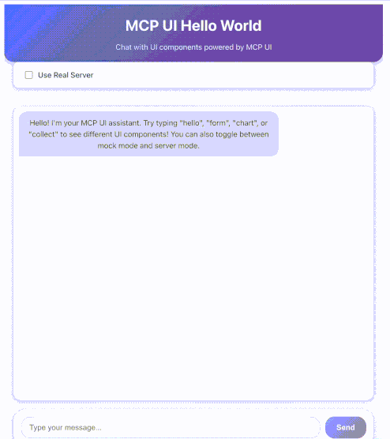

# MCP UI with VGS Collect Integration

A demonstration of how to integrate [VGS Collect](https://www.verygoodsecurity.com/docs/api/collect) with the [MCP UI framework](https://mcpui.dev/) to create secure, agentic payment collection interfaces.

## Overview

This demo showcases how to build an AI agent that can securely collect payment information from users without any PCI-sensitive data passing through the agent itself. The solution leverages VGS Collect's native iFrame interface to isolate sensitive payment data from the parent application and AI agent.



### Key Features

- 🔒 **PCI Compliance**: Sensitive payment data never touches your servers or AI agent
- 🤖 **Agentic Interface**: AI agents can trigger secure payment forms through MCP UI
- 🎨 **Modern UI**: Clean, responsive interface built with React and Bootstrap
- ⚡ **Real-time Integration**: Seamless communication between agent and payment form
- 🛡️ **Security First**: Built on VGS's battle-tested security infrastructure

## Architecture

```
┌─────────────────┐    ┌─────────────────┐    ┌─────────────────┐
│   AI Agent      │    │   MCP UI        │    │   VGS Collect   │
│   (User Chat)   │◄──►│   Frontend      │◄──►│   iFrame        │
└─────────────────┘    └─────────────────┘    └─────────────────┘
         │                       │                       │
         │                       │                       │
         ▼                       ▼                       ▼
┌─────────────────┐    ┌─────────────────┐    ┌─────────────────┐
│   MCP Server    │    │   React App     │    │   VGS Vault     │
│   (Backend)     │    │   (Port 3008)   │    │   (Tokenized)   │
└─────────────────┘    └─────────────────┘    └─────────────────┘
```

### How It Works

1. **User Interaction**: User types "collect" in the chat interface
2. **Agent Response**: AI agent triggers the MCP UI tool to render a payment form
3. **Secure Collection**: VGS Collect iFrame securely collects payment data
4. **Tokenization**: Sensitive data is tokenized by VGS before reaching your systems
5. **Agent Continuation**: Agent receives only tokenized data for further processing

## Prerequisites

- Python 3.12+
- Node.js 18+
- VGS Account with Collect enabled
- UV package manager (recommended)

## Setup

### 1. Environment Configuration

Create a `.env` file in the backend directory:

```bash
cd examples/mcp-ui-collect/backend
cp env.example .env
```

Edit the `.env` file with your VGS credentials:

```env
VGS_CLIENT_ID=your_vgs_client_id
VGS_CLIENT_SECRET=your_vgs_client_secret
```

### 2. Backend Setup

```bash
cd examples/mcp-ui-collect/backend

# Install dependencies
uv sync

# Run the MCP server
uv run main.py
```

The backend server will start on `http://localhost:8000`.

### 3. Frontend Setup

```bash
cd examples/mcp-ui-collect/frontend

# Install dependencies
npm install

# Start development server
npm run dev
```

The frontend will be available at `http://localhost:3008`.

## Usage

1. **Start both servers** (backend and frontend)
2. **Open your browser** to `http://localhost:3008`
3. **Type "collect"** in the chat prompt
4. **Fill out the payment form** that appears
5. **Submit the form** to see the tokenized data

### Available Commands

- `collect` - Opens the secure payment collection form
- `hello` - Shows a simple hello world component
- `form` - Displays a basic contact form

## Project Structure

```
mcp-ui-collect/
├── backend/
│   ├── main.py          # MCP server with VGS integration
│   ├── collect.html     # VGS Collect form template
│   ├── script.js        # Client-side form handling
│   ├── pyproject.toml   # Python dependencies
│   └── .env            # Environment variables
├── frontend/
│   ├── src/
│   │   ├── App.tsx     # Main React component
│   │   └── main.tsx    # Application entry point
│   ├── package.json    # Node.js dependencies
│   └── vite.config.ts  # Build configuration
└── README.md
```

## Security Features

- **PCI DSS Compliance**: VGS handles all PCI requirements
- **Data Isolation**: Sensitive data never touches your infrastructure
- **Tokenization**: All sensitive data is immediately tokenized
- **iFrame Security**: Payment form runs in isolated iframe
- **CORS Protection**: Proper cross-origin resource sharing configuration

## Integration with VGS

This demo integrates with VGS Collect to provide:

- **Secure Card Collection**: Credit card numbers, CVV, expiry dates
- **Real-time Validation**: Built-in field validation and formatting
- **Token Generation**: Automatic tokenization of sensitive data
- **Error Handling**: Comprehensive error states and user feedback

## Development

### Backend Development

The backend uses FastMCP to create MCP tools that can render UI components:

```python
@mcp.tool()
def collect(ctx: Context):
    return EmbeddedResource(
        type="resource",
        resource=TextResourceContents(
            uri=AnyUrl("ui://vgs-collect/form"),
            mimeType="text/html",
            text=collect_html_template
        ),
    )
```

### Frontend Development

The frontend is a React application using MCP UI client:

```typescript
import { MCPUIClient } from '@mcp-ui/client';

const client = new MCPUIClient({
  serverUrl: 'http://localhost:8000'
});
```

## Troubleshooting

### Common Issues

1. **CORS Errors**: Ensure both servers are running and CORS is properly configured
2. **VGS Authentication**: Verify your VGS credentials in the `.env` file
3. **Port Conflicts**: Check that ports 3008 and 8000 are available
4. **Dependencies**: Run `uv sync` and `npm install` to ensure all dependencies are installed

### Debug Mode

Enable debug logging by setting the log level in the backend:

```python
logging.basicConfig(level=logging.DEBUG)
```

## Next Steps

- [ ] Implement payment processing with tokenized data

## Resources

- [VGS Collect Documentation](https://www.verygoodsecurity.com/docs/api/collect)
- [MCP UI Framework](https://mcpui.dev/)
- [VGS Agentic Commerce Tutorial](https://docs.verygoodsecurity.com/agentic-commerce/)
- [FastMCP Documentation](https://github.com/jlowin/fastmcp)

## License

MIT License - see LICENSE file for details.

