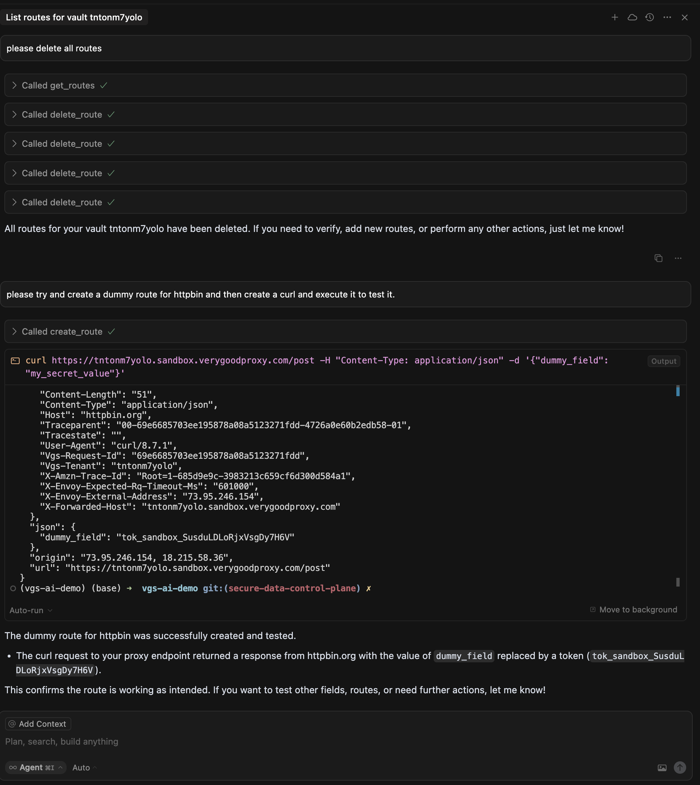

# Vault MCP

This project uses `fastmcp` and `uv` to initialize and run a MCP server for configuring the VGS Secure Data Platform (Vault + Proxy).

## Prerequisites

- Python 3.x
- `fastmcp` and `uv` libraries installed

## Installation

To install the required libraries, run:

```bash
pip install uv
uv venv
source .venv/bin/activate
```

## Running the Application

To run the application, navigate to the `mcp` directory and execute the following command:

```bash
uv --directory $(pwd) run main.py
```

This will start the FastMCP server and print a confirmation message. 

To see an example configuration look at `mcp.json` which shows a sample configuration file. Note the environment variables which are configured using instructions from SETUP.md

Make sure you ask your model to read SETUP.md to configure environment variables and ROUTES.md to learn how to manage routes. 

## Quick Start

Please read and follow [SETUP.MD](SETUP.md). Once that's done, and you've configued the MCP server with your agent you can try the following prompts. 



### Make your Agent Intelligent

> please read @ROUTES.MD 

### See Your Vault Configuration

> list all the routes for my vault tntonm7yolo

### Configure Your Vault

> create an inbound route which forwards to httpbin.org/post and test this

or 
> please read @https://docs.stripe.com/api/cards/create  and change the payload to match this. please retain the /post url for testing since we are using httpbin, not stripe for testing purposes.
> the sample request we should use is this one
> 
> curl https://api.stripe.com/v1/cards \
>  -u sk_test_4eC39HqLyjWDarjtT1zdp7dc: \
>  -d customer="cus_9s6XGDTHzA66Po" \
>  -d source[object]="card" \
>  -d source[number]="4242424242424242" \
>  -d source[exp_month]="12" \
>  -d source[exp_year]="2024" \
>  -d source[cvc]="123"
>
> notice it's form data, not json. 
> 
> please preview to me how you will change this route's configuration before you apply it.

If you're getting stuck, get some extra logs

> please enable debug logs for tntonm7yolo

Run a request and then try it again

> pleae get access logs for request f63baabcd5a0dfdc88084c040ccb8c1e
